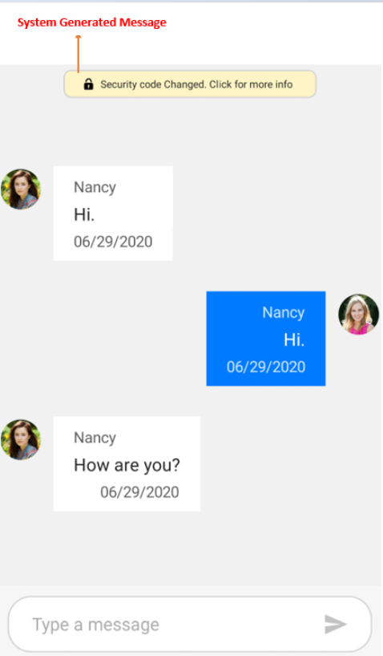

# Chat-System-Generated-Message-Template
This repository provides information on how to load templates for system generated messages in a Xamarin.Forms chat control.

## Messages without author (System Generated Messages / Admin messages) in Xamarin chat

With the help of templates, you can also display messages showing any piece of information, like the security messages in whatsapp or any other admin messages. These messages can be added to the `SfChat.Messages` collection without any value for `Message.Author`.
In the below code example, we have loaded a custom template if the message's author is null to show a security message from admin.



using Syncfusion.XForms.Chat;
using Xamarin.Forms;

namespace GettingStarted
{
    public partial class MainPage : ContentPage
    {
        SfChat sfChat;
        GettingStartedViewModel viewModel;
        public MainPage()
        {
            InitializeComponent();
            sfChat = new SfChat();
            viewModel = new GettingStartedViewModel();
            this.sfChat.Messages = viewModel.Messages;
            this.sfChat.CurrentUser = viewModel.CurrentUser;
            this.sfChat.MessageTemplate = new CustomMessageTemplateSelector() { Chat = this.sfChat };
            this.Content = sfChat;
        }
    }
}

public class MessageTemplateSelector : ChatMessageTemplateSelector
{
	private readonly DataTemplate customMessageTemplate;
	public MessageTemplateSelector(SfChat sfChat):base(sfChat)
	{
		this.customMessageTemplate = new DataTemplate(typeof(CustomMessageTemplate));
	}

	protected override DataTemplate OnSelectTemplate(object item, BindableObject container)
	{
		var message = item as IMessage;
		if (message == null)
		return null;

		if (item as ITextMessage != null)
		{
			if ((item as ITextMessage).Author == null)
			{
				return customMessageTemplate;
			}
			else
			{
				return base.OnSelectTemplate(item,container);
			}
		}
		else
		{
			return null;
		}
	}
}



